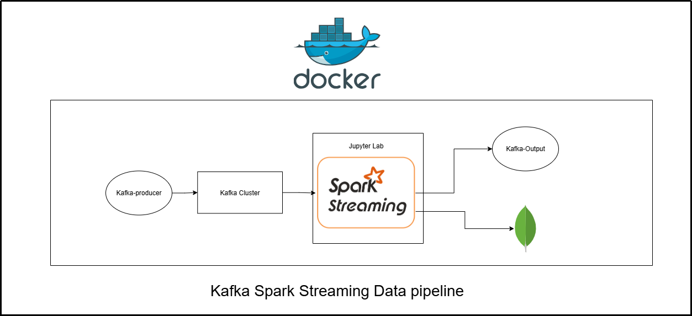
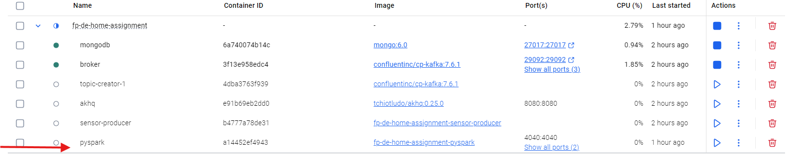
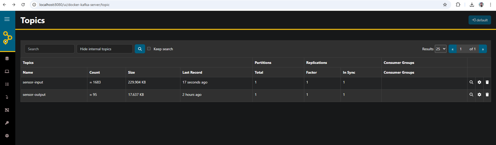
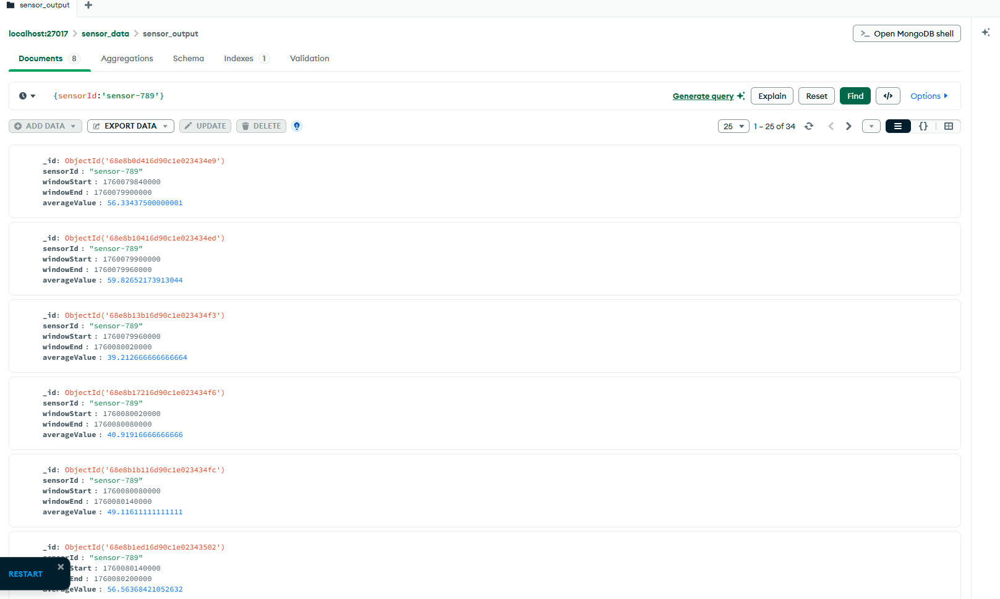

# Sensor Data Streaming Pipeline

Real-time sensor data streaming pipeline using **PySpark Structured Streaming** and **Kafka**.

## Overview

This project ingests sensor data from a Kafka topic, performs real-time aggregation, and writes the results to another Kafka topic.

**Features:**

- Reads sensor data from Kafka topic: `sensor-input`
- Aggregates sensor readings in **1-minute windows**
- Computes the **average value** for each sensor per minute
- Writes aggregated results to Kafka topic: `sensor-output`
- Supports unit testing for transformations
- Modular design with separate transformation and sink modules

---

## Architecture

Kafka : To persist the incoming streaming messages and deliver to spark application

Spark: Structured Streaming to process the data from kafka, aggregating data using Data Frames. (Spark-SQL).

Spark Structured Steaming API: For writing out the data streams to RDBMS/ NoSQL databases/datawarehouse like Hive/S3.



## Prepare your development environment

- Install Docker in your local machine
- Run Kafka and Kafka Producer

Go to the current project directory and run the following command in your terminal.

```
docker-compose up --build

```

- Wait for 2-3 minutes until all of the docker containers are running.
- Then click on pyspark container and go to logs and click on the link starting with http://127.0.0.1:8888/
  
- After clicking the link the jupyter lab will be opened

## Running Pyspark datapipeline

- Open a terminal from jupyter lab UI
- Make sure you are in this dir /home/jovyan/work
- Run this command to start the pyspark job for ingesting real time data and out the aggregated events to sensor-output topic

```
spark-submit --master local[*] --packages org.apache.spark:spark-sql-kafka-0-10_2.12:3.5.1,org.mongodb.spark:mongo-spark-connector_2.12:10.3.0 src/main.py

```

## Running Test for Pyspark datapipeline

- Open a terminal from jupyter lab UI
- Change the dir to /home/jovyan/work/src
- Run this command to unittest data pipeline

```
pip install pytest
python -m pytest tests/ -v

```

## Checking the output

### Kafka Output

- Check the Kafka UI at http://localhost:8080/ui/docker-kafka-server/topic
- sensor-input have the input data
- sensor-output have the aggreated output data
  

### MongoDB Output

- Intall MongoDB Compass in your local machine
- Create a connection with mongodb://localhost:27017
- Go to sensor data db and click on sensor output collection to view and query the data
  
